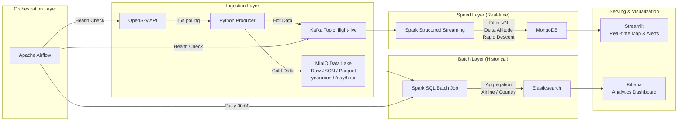

```mermaid
flowchart LR
    %% =====================
    %% Ingestion Layer
    %% =====================
    subgraph INGESTION["Ingestion Layer"]
        A[OpenSky API] -->|15s polling| B[Python Producer]
        B -->|Hot Data| K[Kafka Topic: flight-live]
        B -->|Cold Data| M[MinIO Data Lake
Raw JSON / Parquet
year/month/day/hour]
    end

    %% =====================
    %% Speed Layer
    %% =====================
    subgraph SPEED["Speed Layer (Real-time)"]
        K --> S[Spark Structured Streaming]
        S -->|Filter VN
Delta Altitude
Rapid Descent| MDB[MongoDB]
    end

    %% =====================
    %% Batch Layer
    %% =====================
    subgraph BATCH["Batch Layer (Historical)"]
        M --> SB[Spark SQL Batch Job]
        SB -->|Aggregation
Airline / Country| ES[Elasticsearch]
    end

    %% =====================
    %% Orchestration
    %% =====================
    subgraph ORCH["Orchestration Layer"]
        AF[Apache Airflow]
        AF -->|Daily 00:00| SB
        AF -->|Health Check| K
        AF -->|Health Check| A
    end

    %% =====================
    %% Serving & Visualization
    %% =====================
    subgraph SERVING["Serving & Visualization"]
        MDB --> ST[Streamlit
Real-time Map & Alerts]
        ES --> KB[Kibana
Analytics Dashboard]
    end
```